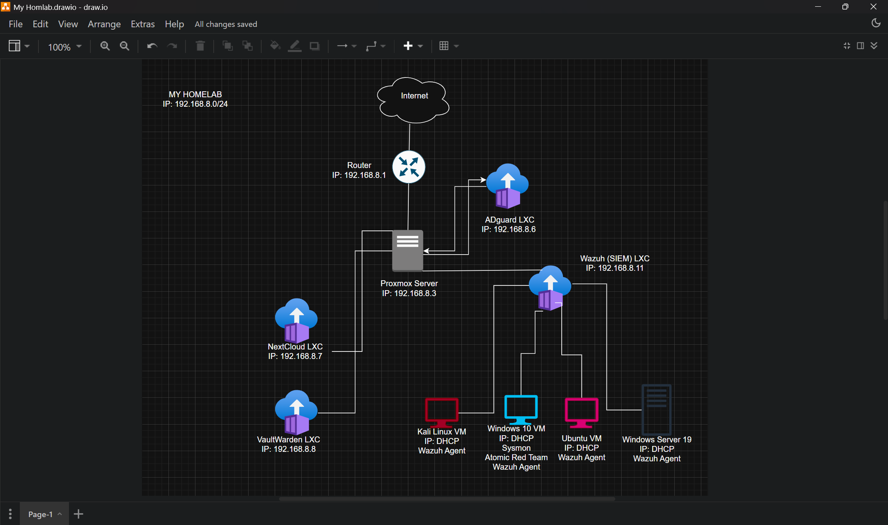

# 🏠 Homelab Overview
-----------------------------------------------------------------------------------------------------------------------------

This homelab is built around a **Proxmox virtualization server** hosting multiple Linux Containers (LXCs) and Virtual Machines(VMs) for security monitoring, private cloud storage, DNS filtering, password management, and cybersecurity testing.

---

---

## 🌐 Network Information

- **Network Range:** `192.168.8.0/24`
- **Gateway/Router:** `192.168.8.1`

---

## 🖥️ Core Infrastructure

### 🔧 Router
- **IP Address:** `192.168.8.1`
- Provides:
  - Internet connectivity
  - Internal network routing
  - DHCP services (for dynamic IP assignment)

---

### 🖥️ Proxmox Virtualization Server
- **IP Address:** `192.168.8.3`
- Main hypervisor hosting:
  - Linux Containers (LXCs)
  - Virtual Machines (VMs)
- Central platform for:
  - Virtualization
  - Network services
  - Security monitoring
  - Lab experimentation

---

## 📦 Linux Containers (LXC)

### 🛡️ AdGuard Home LXC
- **IP Address:** `192.168.8.6`
- Purpose:
  - DNS filtering
  - Ad blocking
  - Malware domain protection
  - Network-wide DNS management

#### Features
- Blocks ads and trackers
- Improves browsing speed
- Provides DNS statistics and logs

---

### ☁️ Nextcloud LXC
- **IP Address:** `192.168.8.7`
- Purpose:
  - Self-hosted cloud storage
  - File synchronization
  - Private collaboration platform

#### Features
- Personal cloud storage
- Secure file sharing
- Remote access to files
- Alternative to Google Drive/OneDrive

---

### 🔐 Vaultwarden LXC
- **IP Address:** `192.168.8.8`
- Purpose:
  - Self-hosted password manager
  - Lightweight Bitwarden-compatible server

#### Features
- Secure credential storage
- Password sharing
- Multi-device synchronization
- Low resource usage

---

### 📊 Wazuh SIEM LXC
- **IP Address:** `192.168.8.11`
- Purpose:
  - Security Information and Event Management (SIEM)
  - Centralized log collection and monitoring

#### Features
- Threat detection
- Intrusion monitoring
- Endpoint visibility
- Log analysis
- Security alerting

---

## 💻 Virtual Machines

### 🐉 Kali Linux VM
- **IP Address:** DHCP Assigned
- Connected to:
  - Wazuh Agent

#### Purpose
- Penetration testing
- Security research
- Vulnerability assessments
- Red team exercises

---

### 🪟 Windows 10 VM
- **IP Address:** DHCP Assigned
- Tools Installed:
  - Sysmon
  - Atomic Red Team
  - Wazuh Agent

#### Purpose
- Endpoint monitoring
- Threat simulation
- Detection engineering
- Windows security testing

### Security Tooling
- **Sysmon**
  - Advanced Windows event logging

- **Atomic Red Team**
  - Simulates adversary techniques for detection testing

---

### 🐧 Ubuntu VM
- **IP Address:** DHCP Assigned
- Connected to:
  - Wazuh Agent

#### Purpose
- Linux server testing
- Security monitoring
- General Linux workloads

---

### 🪟 Windows Server 2019 VM
- **IP Address:** DHCP Assigned
- Connected to:
  - Wazuh Agent

#### Purpose
- Active Directory testing
- Windows server administration
- Enterprise environment simulation

---

## Proxmox Server
